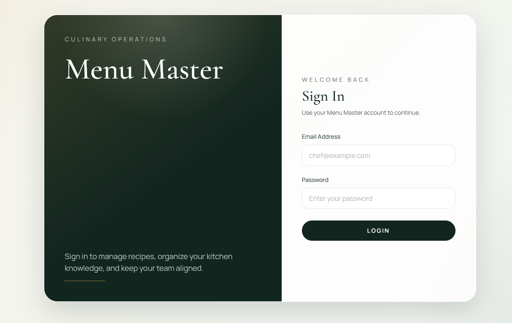
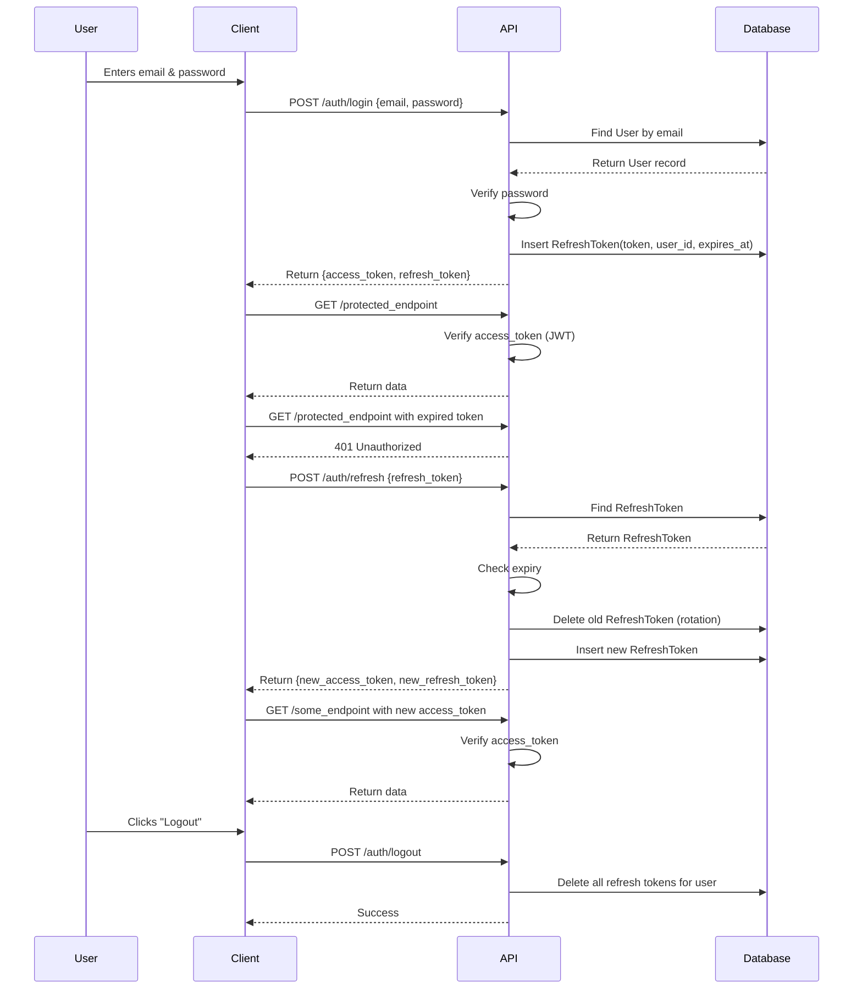
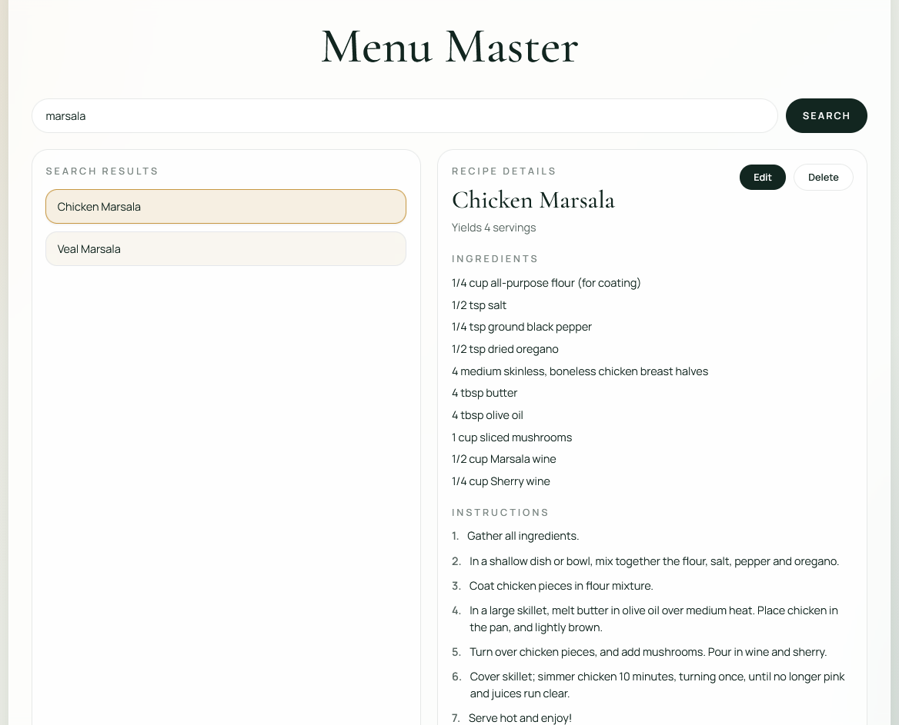
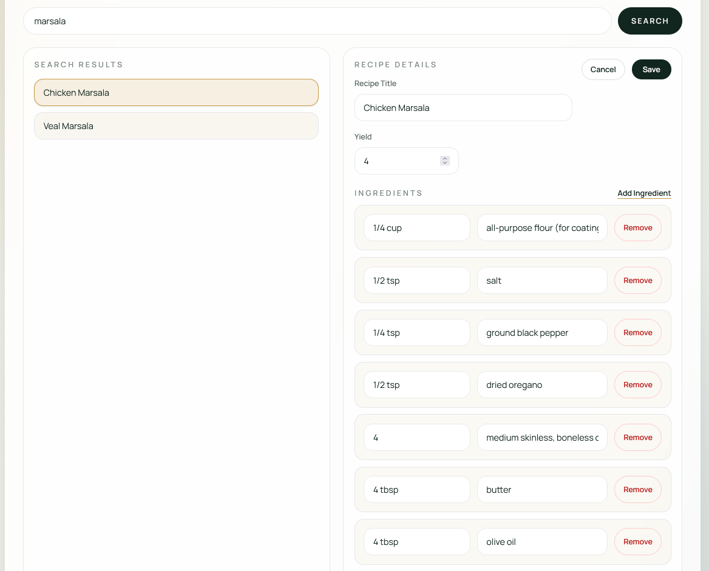
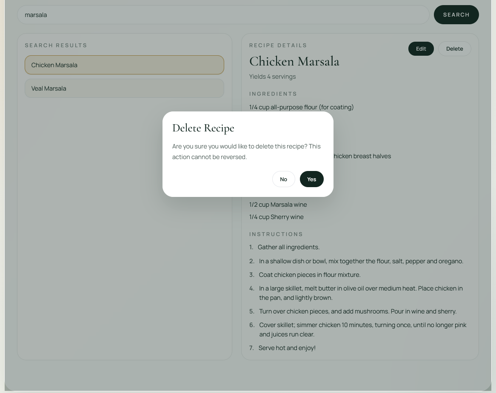

# menu-master

We built a web application to manage your restaurant's recipes. This allows employees of your business to search and maintain all of your delicious food dishes. This can be considered the "secret sauce" for any winning restaurant.

At this time, it is only designed for a desktop browser experience.

## Use Cases

Here are some high-level use cases for this project. As a multi-container setup, these diagrams will explain how a user interacts with them.

### Login (Authentication)

A user needs to prove they are permitted access to the menu-master system. That means authentication (they can access the app) and authorization (they can only view recipe data visible to their account.) We securely manage the data for many restaurants, so you can only view your recipes.



Here is a diagram that illustrates the authentication flow for logging in with an existing user and requesting a new refresh token. A user's email and password are sent from the login screen as shown here:



### Search for a Recipe

The most common task is to find a recipe a user needs. This utilizes partial text search, so all recipes matching your query will be returned. Only recipes owned by a user's organization will be returned.

Clicking on a chosen recipe expands its details. This makes it easier to view it.



### Edit a Recipe

When a user selects a chosen recipe, they are free to edit it by clicking the "Edit" button. They can modify the recipe's name, ingredient list, directions, etc. Clicking the "Save" button persists their changes to the database.



### Delete a Recipe

When a user selects a chosen recipe, they are free to delete it. Clicking the "delete" button will display a modal to ask the user to confirm this action. Confirming this action will delete that recipe from the database.



## Dependencies

* Linux operating system or Docker Desktop
* Docker 29 or higher
* Docker Compose v5.0.0 or higher

## Database Configuration

Create a file called `.env-mongo-access` in the root of this repository. Copy the following contents and paste them into this file. This is required to read and write to the MongoDB database instance.

```ini
MONGO_APP_USER=<username chosen for your database>
MONGO_APP_PASSWORD=<password chosen for your database>
MONGO_APP_DB=recipes
MONGO_HOST_PORT=27017

JWT_SECRET_KEY=jfoiewjfoiewnfiolewnfoliewneiofnewiofnoweinefio
```

When you need to access a command line terminal for the MongoDB container, use the `mongosh` utility. Here is an example for how to connect to the database using the environment variables injected into the container by the .env file.

```bash
mongosh --username $MONGO_APP_USER --password $MONGO_APP_PASSWORD --authenticationDatabase $MONGO_APP_DB
```

## Installation (Local Development)

This project is a group of Docker containers that are connected via Docker networking. For local development, use standard docker compose commands. Run the following commands from the root of this repository to build and deploy a local instance of all containers:

```bash
docker compose build
docker compose up -d
```

## API Documentation

FastAPI provides Swagger and Redoc out of the box. This provides automatically generated API documentation and a web-based client to understand the provided endpoints, their expected inputs, and more.

* Swagger: http://127.0.0.1:8080/docs#/
* Redoc: http://127.0.0.1:8080/redoc

## Architectural Considerations

### Docker

Several considerations were made when designing Menu Master. First, it leverages Docker containers for all key services. This allows development on local machines as well as deployment to a variety of computing resources (AWS, Microsoft Azure, etc.). Another benefit is scalability. Docker containers can be dynamically provisioned as demand increases. This can be accomplished via Kubernetes, AWS Elastic Container Service (Fargate), or other such services.

For local development, Docker Compose is an efficient way to spawn all interconnected services. Only one instance of each container is created, but this is helpful to manage a platform-independent feature roadmap. Below is a high-level view into all deployed services.

```mermaid
architecture-beta
    group menu_master(cloud)[Menu Master]

    service db(database)[MongoDB Container] in menu_master
    service api(logos:fastapi)[Menu Master API Container] in menu_master
    service ui(logos:nextjs)[User Interface Container] in menu_master

    db:L <--> R:api
    api:L <--> R:ui
```



### FastAPI

FastAPI was chosen since it is a robust framework for connecting to datastores, managing precondition logic for authentication, making CRUD actions. One valuable feature is automatically generating a Swagger webpage client and Redoc documentation out-of-the-box. By using Pydantic, Python can enforce strongly-typed patterns and run asynchronous endpoints.

### MongoDB

MongoDB is a flexible document store database. Instead of a relational database where a schema is rigidly enforced upon every row in a table, this stores documents. This allows for easier nesting of related fields to an object. This provides advantages of intuitively keeping a food recipe together. Nested properties like ingredients and instructions can be easily added/removed.

Another benefit is highly performant partial-text search is supported.

One consideration for a NoSQL-style database is that all access patterns must be defined in the API layer. That is required, since no rigid schema enforcement happens within MongoDB itself.

MongoDB has no issues in storing and querying 1,000 recipe records.

### Next.js + Tailwind CSS

Next.js is a powerful front-end framework to design effective user interfaces. TypeScript was intentionally chosen over JavaScript, since the transpiling process catches typing errors and communicates data formats. Tailwind CSS also provides many beautiful UI design capabilities for customized controls.

## Future Roadmap Suggestions

Here are some future items to consider for extending this project.

### Valkey (a.k.a. Redis) Caching
Valkey is the open source fork of Redis, a performant data caching engine. If the same recipes are repeatedly queried, a cache may provide better performance. This can reduce the longer duration operations of querying the database, especially when it is a contested resource.

We must take care to ensure there is adequate memory allocated to the cache. Otherwise there is a risk of thrashing, when cache misses repeatedly occur and displace existing data.

### Horizontal scaling

Spawn additional instances of containers to distribute workloads. This can be accomplished by a provisioning system like Kubernetes, AWS Fargate, etc. Auto-scaling can be configured to create more container instances if traffic spikes after a certain amount of time.

### Domain name and TLS certificates

Assigning a domain name will be required for a production deployment. This makes the website easy to find or appear in search engine results.

User security is paramount. Creating valid Transport Layer Security (TLS) certificates proves that Menu Master is trusted with your data. The TLS certs prove the authenticity of this web app via a trusted certificate signing provider.
